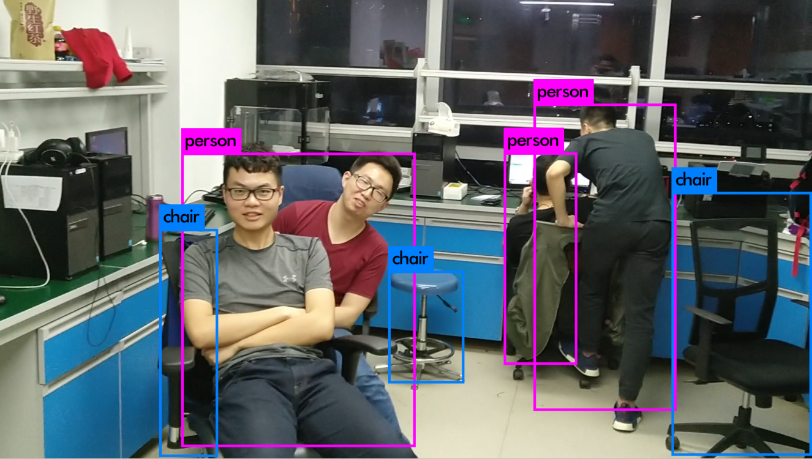

# YOLOv3 Object Detection

## 1.  How to use

First prepare the YOLO-v3 weights under your root accessing to [YOLO-v3-320](https://pjreddie.com/media/files/yolov3.weights), please refer to [Darknet Project](https://pjreddie.com/darknet/yolo/) for more details about implementation of YOLO.

Then simply run **`sh demo.sh`** if  there is **test_multiface.mp4** under under your root.

Or if you have a remote **ip camera**, run **`sh demo_ipcam.sh`** for acquiring remote video stream.

## 2. TODO

- [ ] Build dataset collected from C2 15-th floor
- [ ] Fine tune on the collected dataset

---

The follows come from the original YOLOv3 repo.

# Modifications #
- in *./src/image.c* before the line *func draw_box_width* add condition  
to limit detections in several types.

# Darknet #
Darknet is an open source neural network framework written in C and CUDA. It is fast, easy to install, and supports CPU and GPU computation.

For more information see the [Darknet project website](http://pjreddie.com/darknet).

For questions or issues please use the [Google Group](https://groups.google.com/forum/#!forum/darknet).
