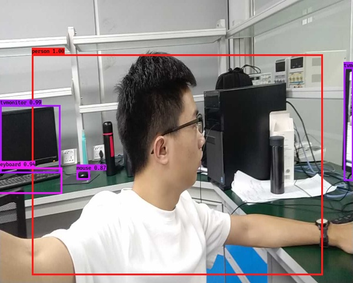

# Robot Vision

## 0. How to demo

The present work has concluded face recognition and object detection, u can use

`python3 video_demo.py --viedo_path=0 --detect_face=True --detect_object=True`

to use both of them, or run `sh ip_camera_demo.sh` to use remote IP camera.

For fast video processing, the interval that frame is being processed is set in

**cfg/face_config.py** and **cfg/object_config.py**

Use smaller interval if you have more powerful GPU :）

When you have set `--detect_face=True`, you may press bottom **f** to caputure one frame and do face recognition.

Samely when `--detect_object=True`, you may press bottom **o** to caputre one frame and do object detection.

## 1. Fundamental tasks

- [x] **Face recognition**

  Used for identity verification.

- [x] **Single object tracking**

  Used for tracking which can help robot movement following specific objects.

- [x] **Object detection**

  Detect multiple common objects on each frame.

- [x] **Obstacle detection via depth image**

  Detect obstacles on depth image collected by the Intel realsense with fast opencv approach.

  

## 2. Further tasks

### Face recognition

- [x] **Less frames for face verification**

  We only need several frames to do face verification instead of real-time capturing.

- [ ] **Face detection with speech interaction**

  The robot says hello while confronting guys. We further need an speech activation module, like say hello to the robot then it will respond.

- [ ] **Robust face verification regarding to luminance**

  The current face detection is highly influenced by luminance which deteriorates the accuracy dramatically. 

- [ ] **Living face verification**

  The model cannot discriminate the living face and faces on a display or a paper.

### Single object tracking

- [ ] **More robust object tracking**

  Achieve more robust single object tracking, e.g. SiamMask.

### Object detection

- [ ] **Build our own dataset and fine-tune**

  Collect images from Intelligence Park 15th floor and build PASCAL VOC like dataset and try to fine-tune them on YOLO-v3 model.

### Obstacle avoiding

- [ ] **Eliminate the ground**

  Current model cannot remove ground parts from the raw images, which makes it not practical for obstacle avoiding.

- [ ] **Make it an API to access**

  An API will be built based on this module for its further application on SLAM.

