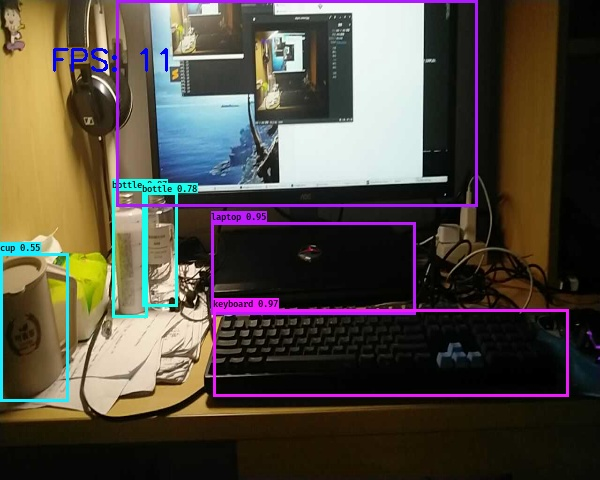

# Robot Vision

## 0. How to demo

The present work has concluded face recognition and object detection, u can use

`python3 video_demo.py --viedo_path=0 --detect_face=True --detect_object=True`

to use both of them, or run `sh video_demo.sh` to use remote IP camera.

For fast video processing, the interval that frame is being processed is set in

**cfg/face_config.py** and **cfg/object_config.py**

Use smaller interval if you have more powerful GPU :）

## 1. Fundamental tasks

- [x] **Face recognition**

  Used for identity verification.

- [x] **Single object tracking**

  Used for tracking which can help robot movement following specific objects.

- [x] **Object detection**

  Assist the robot SLAM, doing route planning.

  

## 2. Further tasks

### 1. Face recognition

- [ ] **Less frames for face verification**

  We only need several frames to do face verification instead of real-time capturing.

### 2. Single object tracking

- [ ] **More robust object tracking**

  Achieve more robust single object tracking, e.g. **SiamMask**.

### 3. Object detection

- [ ] **Build our own dataset**

  Collect images from Intelligence Park 15th floor and build PASCAL VOC like dataset.

- [ ] **Fine-tune on collected dataset**

  Try on advanced object detection model on collected images, e.g. **YOLO v3**.

