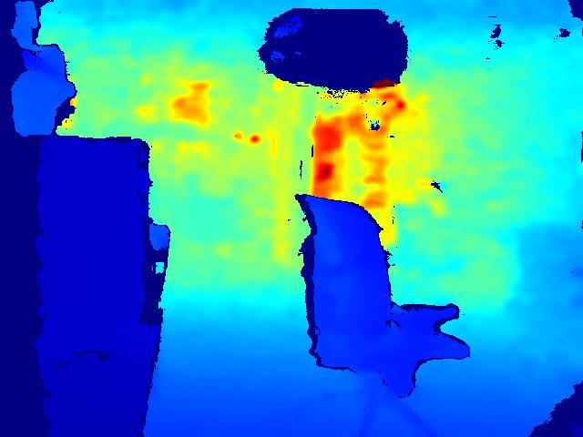
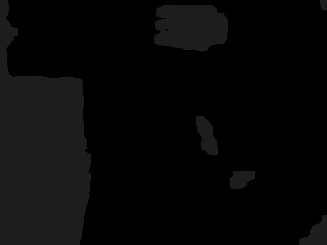
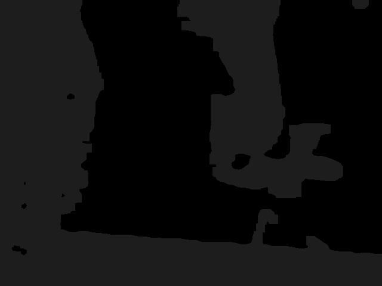
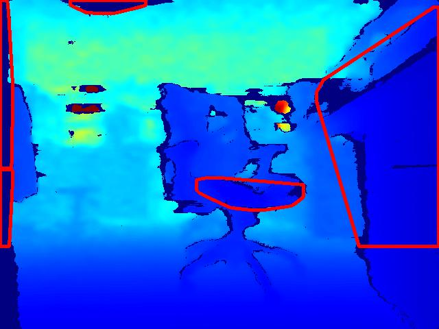
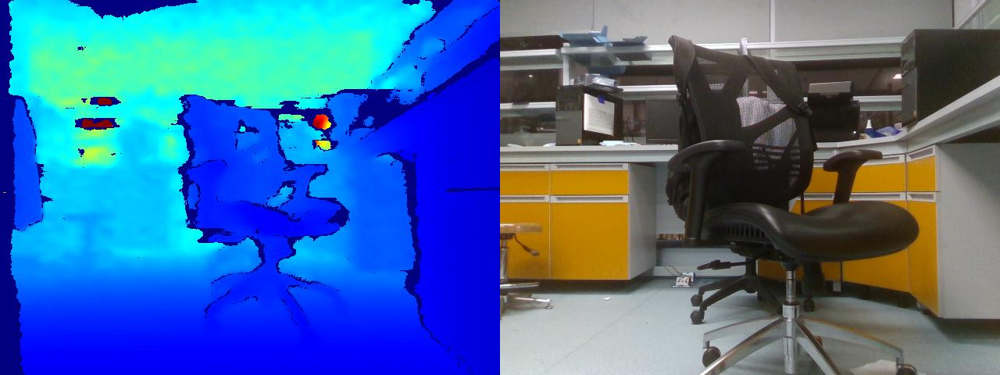
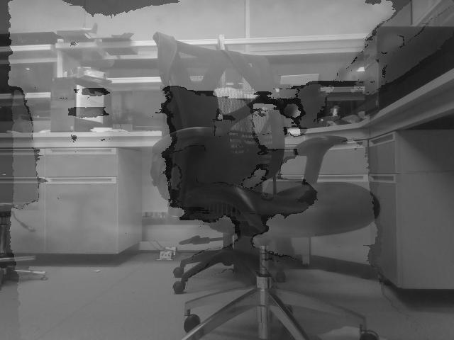

# Obstacle Detection and Avoiding based on Depth Image

## 1. Introduction

Obstacle detection based on depth image. The principle is to group pixels on near distance then put convex hulls on them. This group of pixels can be seen as one obstacle in practice.

## 2. Challenge

### A. Ground

How to eliminate the ground is the core challenge in this module, since the ground itself is a large group of pixels, this can influence the obstacle detection like the following:

#### **Solutions**

- Simply crop the lower 1/3 or 1/4 part of the mask image or place the camera higher on the robot, then the ground will not appear in the contours detection step.

  

- Use machine learning to do segmentation on the ground, classifying pixels belonging to the ground.

  

### B. Calibration

The depth image is not aligned with the rgb image actually, shown as follow:

It can be seen that these two images are not aligned, the left hand side chair seems "closer" than the right hand side one. Unless make these two images aligned, we cannot do obstacle detection based on the depth image and give correct geographical information of the obstacle on the rgb image.

A mixture of above two images demonstrates this difference significantly:

#### **Solutions**

- 