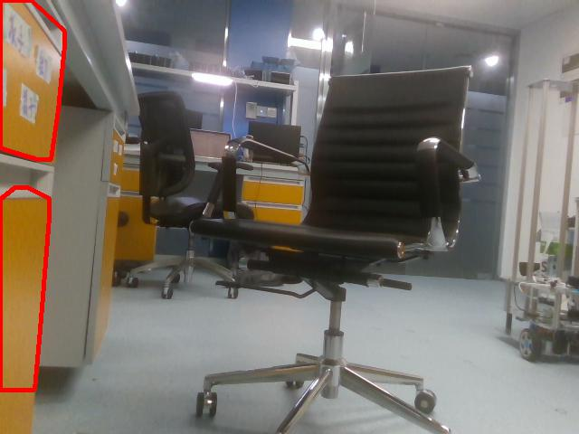

# Obstacle Detection and Avoiding based on Depth Image

## 1. Introduction

Obstacle detection based on depth image. The principle is to group pixels on near distance then put convex hulls on them. This group of pixels can be seen as one obstacle in practice.

## 2. Challenge

### A. Ground

How to eliminate the ground is the core challenge in this module, since the ground itself is a large group of pixels, this can influence the obstacle detection like the following:

### B. Possible solutions

- Simply crop the lower 1/3 or 1/4 part of the mask image or place the camera higher on the robot, then the ground will not appear in the contours detection step.

  

- Use machine learning to do segmentation on the ground, classifying pixels belonging to the ground.