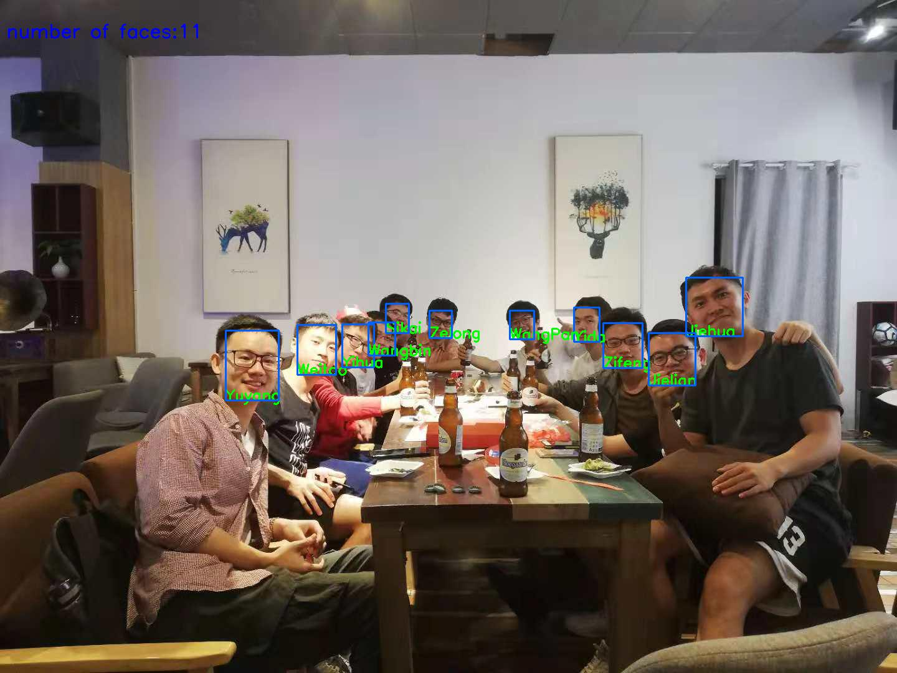

# Real-time Face Detection and Verification #
[TOC]

## 1. Introduction

This is a face detection and verification demo based on tensorflow.

This repo is higly inspired by [**Facenet**](https://github.com/davidsandberg/facenet).

## 2. Pre-requisite

Use `pip3 install -r ./docs/requirements.txt` to check python environment.

The pretrained **Inception-ResNet-v1** is used as embedding extractor, download it on

| Source                                                       | LFW acc | Training dataset | Architecture                                                 |
| ------------------------------------------------------------ | ------- | ---------------- | ------------------------------------------------------------ |
| [Google-drive](https://drive.google.com/open?id=1R77HmFADxe87GmoLwzfgMu_HY0IhcyBz) | 0.9965  | VGGFace2         | [Inception ResNet v1](https://github.com/davidsandberg/facenet/blob/master/src/models/inception_resnet_v1.py) |
| [Baidu-drive (key: 2jsc) ](https://pan.baidu.com/s/1KAsMKpt_QNN8RMBjP9ORLg) | 0.9965  | VGGFace2         | [Inception ResNet v1](https://github.com/davidsandberg/facenet/blob/master/src/models/inception_resnet_v1.py) |

Place this model file under **./ckpt/facenet/20180402-114759**

## 3. Prepare data

The data is stored with this hierarchy

> -data
>
> ​	-raw_images
>
> ​	-images
>
> ​		-person1
>
> ​		-person2
>
> ​		...

### A. Face alignment

You may have raw images (not aligned) like **./data/raw_images/person_a.jpg**

Try to use `python align_face.py --load_path=./data/raw_image/a.jpg` 

or simply `python align_face.py --load_path=./data/raw_images`

The aligned face images will be extracted and saved under **./data/images/person_a/1.jpg**

Notice that each ./data/images/person_a must have **ONLY ONE** image below,

like:

> ./data/images/person_a/1.jpg
>
> ./data/images/person_b/2.jpg
>
> ...

### B. Extract embeddings

After face alignment, use 

`python convert_face_to_emb.py --load_path=./data/images --save_path=./data/face_emb.py`

to extract the embeddings.

The *.npy contains names and embedding array with each unique name.

## 4. Let's DEMO!

### A. Demo on image

Run `python demo.py --image_path=./demo/1.jpg --emb_path=./data/face_emb.npy`

### B. Demo on video

- Camera input: use

   `python video_demo.py --video_path=0 --emb_path=./data/face_emb.npy`

- Video file input: use 

  python `video_demo.py --video_path=test.mp4 --emb_path=./data/face_emb.npy`

